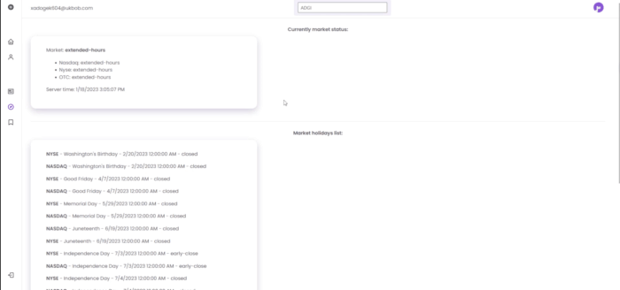

# Stock-Market-WEB

Follow the stocks you care about most and get personalised news and alerts. Access real-time stock information and investment updates to stay on top of the market.
- Follow stocks to get real-time quotes and personalised news
- Discover detailed financial information
- Compare and evaluate stocks with interactive full screen charts

## Technologies
 - MS SQL
 - Blazor

## Getting Started

These instructions will get you a copy of the project up and running on your local machine for development and testing purposes.

### Requirements
 - MS SQL server
 - SendGrid API Key 
 - polygon.io API Key

### Installing

 - Clone the repository 
 git clone https://github.com/ascii00/Stock-Market-WEB.git
 - Change connection string to the database in appsettings.json on yours
 - Also, you will need to add your SendGrid and polygon.io API keys to the appsettings.json
 - Update the database ```dotnet ef database update``` (install EF core tools, if it is not installed ```dotnet tool install -g dotnet-ef```)

After the following steps you are good to go. Good luck!

## Author

- [Maksim Hrynevich](https://github.com/ascii00)

## Implemented functionality: 

* Authorization / registration of new accounts (MSSQL, Blazor authentication)


* Ability to change password and email after account registration

* Email confirmations, resend email confirmations and password reset by mail (SendGrid email provider)

* View basic information about the selected company and its status on the stock market


* Get the main news about the selected companies


* Get information about the current state of the stock market

* Ability to add companies to favorites list 




